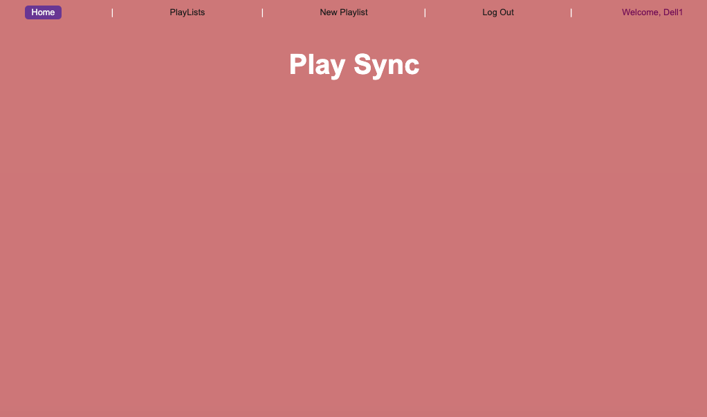

# PlaySync
## Description
**PlaySync** is a dynamic CRUD application designed for music lovers to create, manage, and explore their personalized playlists. With PlaySync, users can add, view, update, and delete songs from their custom playlists, making it easier to organize their favorite tracks and discover new music. The app offers a seamless user experience with a stylish and modern design, ensuring a smooth and enjoyable way to sync with your favorite tunes.

## Experience PlaySync:
[PlaySync] (https://play-sync21-0f1460658093.herokuapp.com/)

## Technologies Used
* **React** for building a dynamic and interactive frontend
* **CSS** for styling and responsive design
* **JavaScript** (Node.js & Express) for backend functionality
* **MongoDB** for database storage of user playlists and song data

## Next Steps
🎨 Style Enhancements:

* Improve the design of the Edit and Delete buttons for better UI consistency
* Refine playlist and song card layouts for better readability and visual appeal
* 🔍 Search & Filtering:

* Implement a search bar to quickly find songs or playlists
* Add filtering options (e.g., by genre, artist, or playlist)
* 📌 Sorting & Organization:

* Allow users to sort playlists alphabetically, by recently added, or by most played
* 🔐 User Authentication:

* Enable user accounts so each user can manage their personalized playlists
* 📱 Mobile Optimization:

* Improve responsiveness to ensure a seamless experience on mobile devices
* ⭐ Additional Features:

* Allow users to rate and review songs or playlists
* Implement song recommendations based on listening habits
Add a dark mode toggle for a customizable experience
* Stay tuned for future updates! 🚀🎶